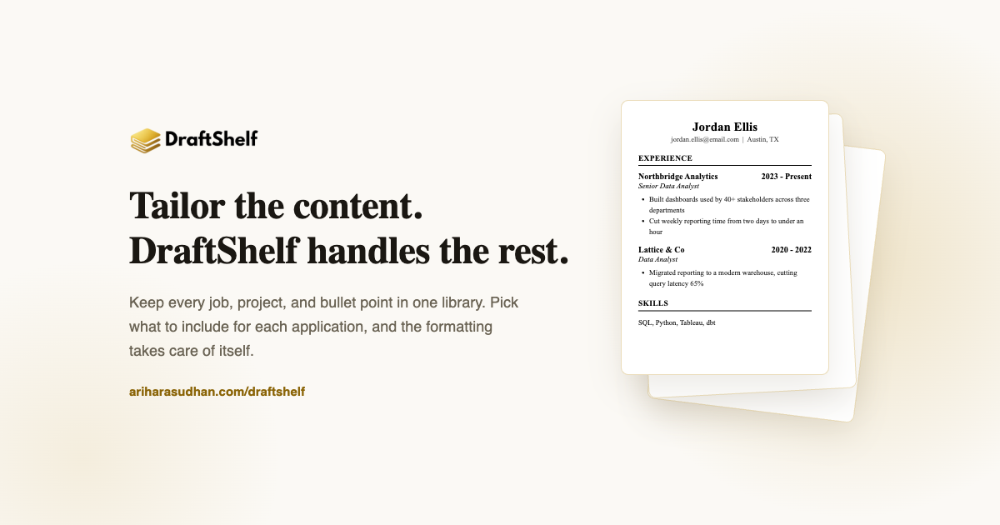
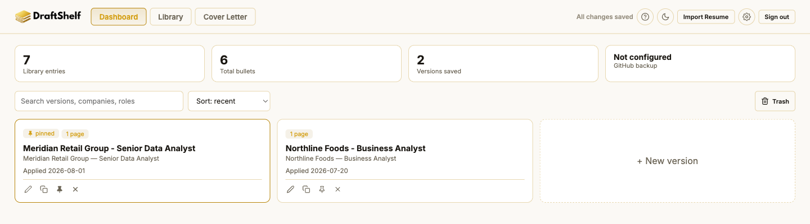
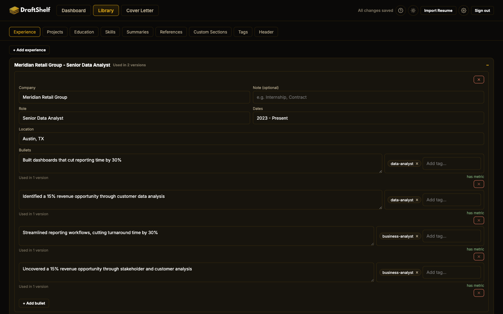
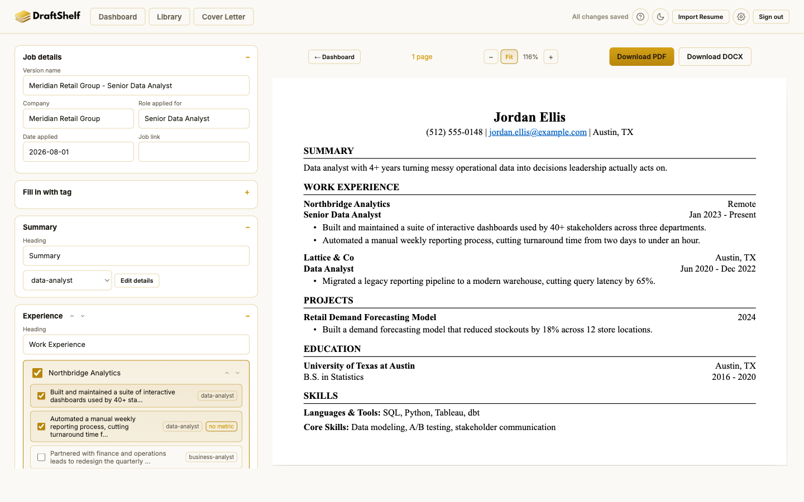
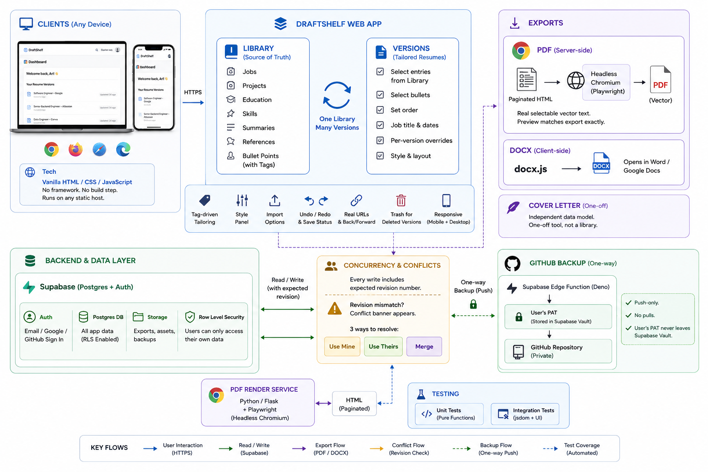

# DraftShelf 📄✨

## Overview

DraftShelf is a resume builder built around one idea: your work history doesn't change every time you apply somewhere, but which parts of it you lead with should. It splits resume data into two layers - a **Library** of every job, project, and bullet point you've ever had, and a **Version**, a tailored resume that's just a *selection* from that Library, not a copy of it. Change a bullet once and every version that uses it updates.

## The Project Involves

- **Vanilla HTML / CSS / JavaScript**: No framework, no bundler, no build step - every script loads straight from a CDN or a local file in dependency order, and the whole app deploys by copying the folder onto any static host.
- **[Supabase](https://supabase.com) (Postgres + Auth)**: The source of truth for every signed-in account, with row-level security doing the actual access control rather than anything client-side.
- **Python / Flask + Playwright (headless Chromium)**: A small server-side service that renders each resume through a real browser for PDF export, so the output carries genuine selectable text instead of a screenshot.
- **docx.js**: A second, independent export path that builds a real Word document client-side.
- **Supabase Edge Functions (Deno)**: A one-way, push-only GitHub backup - a user's own PAT is stored in Supabase Vault and never touches anything but the Edge Function.
- **Plain Node test scripts (no framework)**: Pure-function tests alongside jsdom-driven integration tests that exercise the actual UI.

## Live Demo

**🔗 Live App**: [ariharasudhan.com/draftshelf](https://ariharasudhan.com/draftshelf/)
> Free to use, permanently. Sign up with email/password, Google, or GitHub - there's no local-only or guest mode, since a real account is what makes the Library/Version sync (and the two-device conflict handling below) possible.

## Screenshots

### Dashboard

### Library

### Editor

---

## Why This Exists

Most people end up with one of two messes once they've applied to more than a few jobs. Either there's a single "master" resume that's grown into a list of everything they've ever done - too long, too generic, and never quite right for the job in front of them - or there's a folder of a dozen near-duplicate Word files, each hand-edited for one application, with no way to tell which one has the current phone number or the fixed typo. Both make it easy to send out something stale, and neither actually gets faster the more you use it.

## How It Works

DraftShelf keeps two things separate that most tools bolt together:

- **Your Library** is everything you've ever done - every job, project, degree, skill, summary, and reference, written once. Each entry holds bullet points, and each bullet is a single source of truth: fix it here and it's fixed everywhere it's used.
- **A Version** is one tailored resume - not a copy of anything, just a *pointer* into the Library: which entries are included, which bullets under each, what order they print in, plus that job's own title and dates. Building a new one is picking checkboxes, not retyping a resume.

Because it's a real account with a real database behind it, it also follows you - start a version on your laptop, finish it on your phone.

## Key Features

- **Tag-driven tailoring** - Bullets and skills carry reusable tags; "Fill in with tag" pulls in everything tagged for a role in one click, and just as easily undoes it. Skill Sets bundle categories into a named group you can apply as a whole instead of re-checking the same boxes every time.
- **Overrides when you need an exception** - Need one bullet worded differently for a single application without touching the shared version? Any field can be overridden per-version, or you can choose version-by-version whether a Library edit follows through to existing resumes or leaves them as they were.
- **A real style panel** - Fonts, sizes, spacing, margins, and page size are adjustable per version or set once as your default - no template file to hunt down and edit.
- **Import from wherever you're starting** - Restore your own backup exactly, reconcile an outside file against your existing Library item by item, or bring in a version that stays fully private until you choose to promote pieces of it into your real Library. No PDF or Word file to start from? Paste a ready-made prompt into any AI chatbot and it hands back something DraftShelf can import directly.
- **Exports that hold up** - Pagination never splits a bullet or an entry across a page break, and the live preview matches the export exactly, because it's rendered by an actual headless browser - real selectable text, not a screenshot. DOCX export is a second, independent path that opens cleanly in Word or Google Docs. A matching cover letter tool shares none of the resume's data model - it's a one-off by design, not something you build a library of.
- **Nothing gets lost by accident** - Undo/redo throughout, a save status that's always visible, a two-device-editing conflict banner instead of a silent overwrite, and a Trash for deleted versions instead of a permanent one-click delete.
- **Everywhere it needs to be** - Light and dark theme, real bookmarkable URLs with working back/forward, and a layout that holds up on a phone.

## Architecture

`paginate()` is the layout engine: it builds real DOM nodes for every resume block, measures each one's actual rendered height, and bin-packs them into pages so a heading is never orphaned alone at the bottom and an entry is never split mid-way. PDF export reuses those same already-paginated pages, sending the HTML to a server-side headless-Chromium service instead of screenshotting the browser - real vector text in, real vector text out. Every write to Supabase carries an expected revision number; a mismatch means someone else saved first, and surfaces as a conflict banner with three ways to resolve it, instead of silently overwriting a change.

---

## License

This project is licensed under the MIT License - see the [LICENSE](LICENSE) file for details.

## Contact

For any queries or contributions, feel free to reach out:

- **Ariharasudhan A** – [Email](mailto:ariadaikalam1234@gmail.com)
